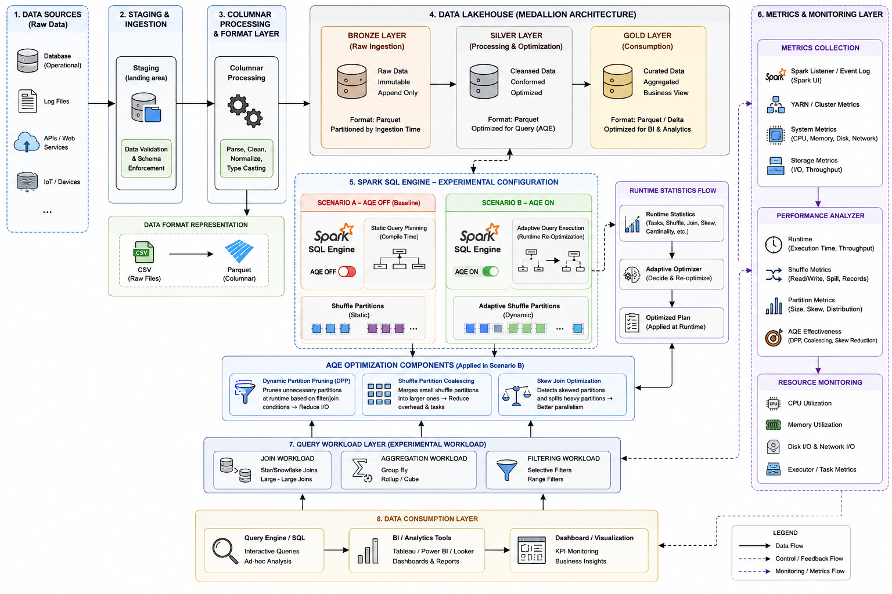

# Data Lakehouse — Adaptive Query Execution (AQE) pada Medallion Architecture

Repositori ini mendukung penelitian big data tentang **efektivitas Adaptive Query Execution (AQE)** pada pipeline **Data Lakehouse Medallion (Bronze → Silver → Gold)**. Fokus penelitian adalah perbandingan eksperimen **AQE OFF (baseline)** vs **AQE ON** terhadap performa query, distribusi partisi, dan efektivitas komponen AQE (DPP, shuffle coalescing, skew join). Konsumsi analitik memakai **Trino** dan **Apache Superset**; observabilitas memakai **Grafana** (sumber metrik dari Spark Event Log, Prometheus, dan metrik cluster).

Narasi arsitektur lengkap: [`docs/README.md`](docs/README.md). Kerangka metodologi dan BAB IV: [`rancangan-metodologi-dan-hasil-pembahasan.md`](rancangan-metodologi-dan-hasil-pembahasan.md).

## Tech Stack

### Infrastructure & Orchestration


### Data Processing & Storage


### Query Engine & Analytics


### Monitoring


### Database


### Languages & Libraries


### Development & Notebook


---

## 1. Rancangan penelitian

### 1.1 Arsitektur pipeline dan posisi AQE

Diagram berikut menggambarkan alur Medallion, **Spark SQL Engine** dengan dua skenario (AQE OFF / ON), workload query eksperimen, serta lapisan metrik dan konsumsi (Trino, Superset, Grafana).



**Ringkasan (BAB IV 4.1.1)**

| Aspek | Penjelasan singkat |
|--------|---------------------|
| **Alur data** | Sumber → Staging → Columnar (CSV/Parquet) → Bronze (raw) → Silver (transform + optimasi AQE) → Gold (star schema / KPI). |
| **Eksperimen AQE** | **Skenario A (OFF):** rencana query statis, shuffle partition tetap. **Skenario B (ON):** re-optimasi runtime dari statistik shuffle/join/skew. |
| **Komponen AQE** | Dynamic Partition Pruning, Shuffle Partition Coalescing, Skew Join Optimization. |
| **Konsumsi** | **Trino** membaca tabel Gold (Iceberg/Hive Metastore); **Superset** untuk dashboard KPI dan visualisasi hasil eksperimen. |
| **Monitoring** | **Grafana** menampilkan runtime, shuffle, partisi, resource, dan metrik efektivitas AQE. |

### 1.2 Variabel dan desain eksperimen

| Elemen | Definisi |
|--------|----------|
| **Jenis penelitian** | Eksperimental kuantitatif, komparatif (AQE ON vs OFF), controlled experiment. |
| **Variabel independen** | Konfigurasi AQE (`spark.sql.adaptive.*`). |
| **Variabel dependen** | Execution time, throughput, speedup, distribusi partisi, metrik efektivitas AQE. |
| **Variabel kontrol** | Dataset, ukuran cluster, set query workload. |
| **Workload** | Join, agregasi, filtering (lihat §5). |
| **Format data** | CSV (row-based) vs Parquet (columnar). |

---

## 2. Metodologi penelitian (langkah demi langkah)

1. **Studi literatur** — AQE Spark 3.x, partition skew, DPP, dan lakehouse Medallion.
2. **Perancangan arsitektur** — Sesuai `pipeline-aqe.png` dan [`docs/README.md`](docs/README.md).
3. **Implementasi lingkungan** — Stack kontainer: MinIO, Spark, Hive Metastore, Airflow, Trino, Superset, Grafana (+ Prometheus); `docker-compose.yml` disusun mengikuti panduan ini.
4. **Persiapan dataset** — Generate CSV staging dengan `scripts/generate_bronze_data.py` (profil `aqe`, skew); lihat **§9**.
5. **Pipeline Medallion** — Tiga tahap ETL (Staging→Bronze→Silver→Gold) dengan konfigurasi Spark terkontrol.
6. **Eksperimen AQE** — Jalankan workload yang sama pada **AQE OFF** dan **AQE ON**; kumpulkan metrik dari Spark UI / event log dan Grafana.
7. **Analisis** — Perbandingan runtime, distribusi partisi, efektivitas DPP/coalescing/skew, dampak per layer dan format data.

---

## 3. Ringkas teknologi (stack target)

| Komponen | Fungsi dalam penelitian |
|----------|-------------------------|
| **MinIO** | Object storage S3-compatible: staging, bronze, silver, gold, warehouse. |
| **Apache Spark** | ETL Medallion; **mesin eksperimen AQE** (Scenario A/B). |
| **Hive Metastore** | Katalog tabel Iceberg untuk Spark dan Trino. |
| **Apache Iceberg** | Format tabel terkelola di warehouse. |
| **Apache Airflow** | Orkestrasi DAG pipeline (`scripts/dags/`). |
| **Trino** | Query engine SQL interaktif pada layer Gold (dan Silver untuk uji). |
| **Apache Superset** | Dashboard BI, KPI IKU, visualisasi hasil perbandingan AQE. |
| **Grafana** | Dashboard monitoring: runtime, shuffle, partisi, CPU/memori, efektivitas AQE. |
| **Prometheus** | Scraping metrik cluster/Spark exporter (untuk Grafana). |
| **PostgreSQL** | Metastore Hive, metadata Superset, metadata Airflow. |


---

## 4. Kerangka BAB IV — Hasil dan Pembahasan

Template isi BAB IV; isi angka dan tangkapan layar dari lingkungan eksperimen Anda.

**Alur eksperimen (produksi pipeline, uji AQE OFF/ON, pencatatan metodologi & hasil):** [`docs/eksperimen/README.md`](docs/eksperimen/README.md) · template: [`docs/eksperimen/templates/`](docs/eksperimen/templates/) · acuan outline: [`rancangan-metodologi-dan-hasil-pembahasan.md`](rancangan-metodologi-dan-hasil-pembahasan.md).

### 4.1 Hasil

#### 4.1.1 Hasil eksekusi pipeline Data Lakehouse

Ringkasan Bronze → Silver → Gold: status sukses/gagal, waktu total pipeline, tabel runtime per tahap.

#### 4.1.2 Perbandingan runtime AQE vs non-AQE

| Skenario | Workload | Execution Time (s) | Speedup (%) |
|----------|----------|-------------------|-------------|
| AQE OFF | *diisi* | *diisi* | — |
| AQE ON | *diisi* | *diisi* | *diisi* |

Wajib: grafik bar/line dan persentase speedup.

#### 4.1.3 Distribusi partisi dan data skew

Metrik: mean partition size, std dev, coefficient of variation, Gini coefficient — **sebelum vs sesudah AQE**.

#### 4.1.4 Efektivitas komponen AQE

| Komponen | Metrik | Sebelum | Sesudah | Reduction / ratio |
|----------|--------|---------|---------|-------------------|
| DPP | Jumlah partisi dibaca | *diisi* | *diisi* | *%* |
| Coalescing | Jumlah shuffle partitions | *diisi* | *diisi* | *ratio* |
| Skew join | Distribusi task / partisi | *diisi* | *diisi* | *catatan* |

#### 4.1.5 Perbandingan format data (CSV vs Parquet)

Execution time dan resource usage per format, untuk kedua skenario AQE.

#### 4.1.6 Dampak per layer Medallion

| Layer | Beban query utama | Dampak AQE (ringkas) |
|-------|-------------------|----------------------|
| Bronze | Ingest, scan mentah | *diisi* |
| Silver | Join, agregasi, filter | *diisi* — biasanya paling terasa |
| Gold | Agregasi BI, star schema | *diisi* |

### 4.2 Pembahasan

Bahas: mengapa Silver paling sensitif terhadap AQE; peran runtime statistics; trade-off overhead adaptasi; keterbatasan lingkungan Docker lokal; implikasi untuk tuning produksi.

---

## 5. Workload query eksperimen

Jalankan set query yang sama pada **AQE OFF** dan **AQE ON**:

| Kelompok | Contoh query | Tujuan pengukuran |
|----------|--------------|-------------------|
| **Join** | Star/snowflake join, large-large join | Skew join, shuffle |
| **Aggregation** | `GROUP BY`, rollup/cube | Coalescing, partisi |
| **Filtering** | Filter selektif, range | DPP, I/O reduction |

Skrip benchmark otomatis: [`scripts/benchmark/README.md`](scripts/benchmark/README.md) — workload W1–W6, perbandingan OFF/ON, agregasi `experiment_summary_*.json`, ekspor Grafana. Orkestrator: `run_experiment.py` atau DAG Airflow `aqe_full_experiment`.

---

## 6. Konfigurasi Spark AQE

### Skenario A — Baseline (AQE OFF)

```properties
spark.sql.adaptive.enabled=false
spark.sql.adaptive.coalescePartitions.enabled=false
spark.sql.adaptive.skewJoin.enabled=false
spark.sql.adaptive.localShuffleReader.enabled=false
# shuffle partition tetap, misalnya:
spark.sql.shuffle.partitions=200
```

### Skenario B — AQE ON

```properties
spark.sql.adaptive.enabled=true
spark.sql.adaptive.coalescePartitions.enabled=true
spark.sql.adaptive.skewJoin.enabled=true
spark.sql.adaptive.localShuffleReader.enabled=true
spark.sql.adaptive.advisoryPartitionSizeInBytes=64MB
spark.sql.shuffle.partitions=200
```

Parameter **Silver** diterapkan otomatis lewat `scripts/spark/aqe_config.py` saat DAG `bronze_to_silver_pipeline` dijalankan (`dag_run.conf`: `{"aqe_scenario": "ON"|"OFF"}`). File metrik eksperimen ditulis ke folder `metrics/`. Detail: [`docs/bronze-to-silver/README.md`](docs/bronze-to-silver/README.md).

---

## 7. Arsitektur ringkas (teks)

```
Sumber → Staging → [CSV | Parquet] → Bronze → Silver (AQE) → Gold
                              ↓
                    Spark SQL (Scenario A | B)
                              ↓
              Runtime stats → Adaptive Optimizer (jika AQE ON)
                              ↓
         ┌────────────────────┼────────────────────┐
         ↓                    ↓                    ↓
    Metrics/Grafana      Trino (SQL)         Superset (BI)
```

---

## 8. Layer mapping (Medallion)

| Layer | Storage | Peran dalam penelitian AQE |
|-------|---------|----------------------------|
| **Staging** | `s3a://staging/` | Landing CSV; variasi format row-based |
| **Bronze** | `s3a://bronze/` / Iceberg | Raw ingestion; baseline scan |
| **Silver** | `s3a://silver/` | Transform, join, agregasi — **fokus optimasi AQE** |
| **Gold** | `s3a://gold/` | Star schema IKU; query Trino/Superset |

---

## 9. Generator data staging (`scripts/generate_bronze_data.py`)

Sebelum menjalankan pipeline, buat CSV sintetis domain ITERA di `data/staging/`. Skrip ini mendukung **volume besar** dan **injeksi skew** pada `prodi_id` agar join di Silver memicu shuffle dan uji **skew join** AQE.

### 9.1 Profil volume (`--profile`)

| Profil | Mahasiswa | Perkiraan total baris | Skew default |
|--------|-----------|------------------------|--------------|
| `dev` | 50.000 | ~77 ribu | tidak (`--no-skew`) |
| **`aqe`** (default) | **1.000.000** | **~1,5–2,5 juta** | 75% baris → `prodi_id=IF` |
| `aqe-large` | 2.000.000 | ~3 juta+ | 80% → `IF` |

Tabel turunan (lulusan, MBKM, kegiatan/penelitian dosen, dll.) ikut membesar sehingga beban join/agregasi di Silver meningkat.

### 9.2 Cara pakai

Jalankan dari **root repositori**:

```bash
# Default penelitian AQE (~1M mahasiswa, skew 75% ke prodi Informatika)
python3 scripts/generate_bronze_data.py --mode full

# Lihat rencana volume tanpa menulis file
python3 scripts/generate_bronze_data.py --profile aqe --dry-run

# Uji cepat pipeline (~77 ribu baris, tanpa skew)
python3 scripts/generate_bronze_data.py --profile dev --no-skew

# Stress test cluster kuat
python3 scripts/generate_bronze_data.py --profile aqe-large

# Perbesar lagi: ~2M mahasiswa
python3 scripts/generate_bronze_data.py --profile aqe --scale 2.0

# Skew lebih ekstrem (uji skew join)
python3 scripts/generate_bronze_data.py --profile aqe --skew-fraction 0.85

# Tambah batch incremental (setelah full)
python3 scripts/generate_bronze_data.py --mode append --batch-size 5000
```

### 9.3 Opsi CLI utama

| Opsi | Keterangan |
|------|------------|
| `--mode full` | Overwrite semua CSV di `data/staging/` (default) |
| `--mode append` | Tambah batch baru ke CSV yang ada |
| `--profile dev\|aqe\|aqe-large` | Preset jumlah baris (default: `aqe`) |
| `--scale N` | Pengali di atas profil (mis. `aqe` + `2.0` → ~2M mahasiswa) |
| `--skew-prodi IF` | Hot key untuk join (default: Informatika) |
| `--skew-fraction 0.75` | Fraksi baris ke prodi skew (0–1) |
| `--no-skew` | Distribusi prodi merata |
| `--dry-run` | Tampilkan rencana volume, tanpa menulis file |
| `--output-dir PATH` | Ganti folder output (default: `data/staging/`) |
| `--seed 42` | Seed acak (reproduksibel pada `--mode full`) |

### 9.4 Output dan langkah berikutnya

Setelah selesai, skrip menampilkan **jumlah baris per file** dan **ukuran disk (MB)**. Contoh file:

```
data/staging/
├── raw_mahasiswa.csv      # volume utama
├── raw_dosen.csv
├── raw_lulusan.csv
├── raw_mbkm.csv
├── … (12 file CSV domain ITERA)
└── raw_prodi.csv
```

**Persyaratan perkiraan:**

| Profil | Waktu generate | Disk CSV (perkiraan) | RAM Docker disarankan |
|--------|----------------|----------------------|------------------------|
| `dev` | < 1 menit | ~10 MB | 8 GB |
| `aqe` | beberapa menit | ~150–400 MB | 12 GB+ |
| `aqe-large` | 10+ menit | ~600 MB–1 GB+ | 16 GB+ |

Lalu jalankan pipeline: **Staging → Bronze** → **Bronze → Silver (AQE OFF/ON)** → **Silver → Gold**. Detail: [`docs/staging-to-bronze/README.md`](docs/staging-to-bronze/README.md).

---

## 10. Stack layanan dan menjalankan

Port host default (rentang 15xxx–22xxx). Override lewat `.env` — salin dari [`.env.example`](.env.example).

| Service | Container | Port host |
|---------|-----------|-----------|
| Spark Master + Workers | ETL + eksperimen AQE | **18080** (UI), **17077** (RPC) |
| MinIO | S3 API + console | **19000**, **19001** |
| Hive Metastore | Katalog Iceberg | **19083** |
| Airflow | Orkestrasi DAG | **18681** |
| Trino | Query SQL Gold/Silver | **18088** |
| Superset | Dashboard BI | **18089** |
| Grafana | Monitoring AQE | **13001** |
| Prometheus | Scraping metrik | **19090** |
| PostgreSQL | Metastore, Airflow, Superset | **15432** |
| Jupyter (opsional) | Eksplorasi Spark | **18888** |

Port final diset di `.env` / `docker-compose.yml` (variabel `LHAQE_*` atau setara) agar tidak bentrok dengan layanan lain di host.

**Menjalankan:**

```bash
chmod +x start.sh
./start.sh
```

Atau manual: `docker compose up -d` (lihat urutan di `start.sh`).

**Kredensial default (dev):**

| Service | User | Password |
|---------|------|----------|
| MinIO | minioadmin | minioadmin123 |
| Airflow | airflow | airflow |
| PostgreSQL | admin | admin123 |
| Grafana | admin | admin |
| Superset | admin | admin |

---

## 11. Pipeline Medallion (implementasi)

### 11.1 Pipeline 1: Staging → Bronze

- `scripts/generate_bronze_data.py` — generate CSV ke `data/staging/` (**§9**)
- `scripts/spark/staging_to_bronze.py` — CSV → Iceberg (Parquet)
- `scripts/dags/staging_bronze_pipeline.py` — Airflow DAG

**Panduan:** [`docs/staging-to-bronze/README.md`](docs/staging-to-bronze/README.md)

### 11.2 Pipeline 2: Bronze → Silver (layer AQE utama)

- `scripts/spark/bronze_to_silver.py` — cleaning, join, quality
- `scripts/dags/bronze_silver_pipeline.py` — Airflow DAG
- Konfigurasi **AQE OFF/ON** diterapkan di tahap ini

**Panduan:** [`docs/bronze-to-silver/README.md`](docs/bronze-to-silver/README.md)

### 11.3 Pipeline 3: Silver → Gold

- `scripts/spark/silver_to_gold.py` — star schema (5 dim + 10 fakta IKU)
- `scripts/dags/silver_gold_pipeline.py` — Airflow DAG

**Panduan:** [`docs/silver-to-gold/README.md`](docs/silver-to-gold/README.md)

### 11.4 Konsumsi: Trino + Superset

**Panduan lengkap:** [`docs/gold-to-serving/README.md`](docs/gold-to-serving/README.md) — star schema (ROLAP), koneksi Trino, dataset Superset, dashboard IKU.

### 11.5 Monitoring: Grafana

**Panduan lengkap:** [`docs/monitoring-grafana/README.md`](docs/monitoring-grafana/README.md) — metrik runtime, shuffle, partisi, resource, efektivitas AQE (selaras §11 [`docs/README.md`](docs/README.md)).

---

## 12. Metrik evaluasi (ringkas)

| Kategori | Metrik |
|----------|--------|
| **Runtime** | Execution time, throughput, speedup |
| **AQE** | DPP reduction, coalescing ratio, skew reduction |
| **Partisi** | Mean, std dev, CV, Gini |
| **Resource** | CPU, memory, disk/network I/O |
| **Per layer** | Dampak relatif Bronze / Silver / Gold |

Sumber data: Spark UI (aplikasi selesai), Spark event log, log pipeline Airflow, panel Grafana, hasil query Trino yang di-timestamp.

---

## 13. Berkas pendukung di repositori

| Berkas | Keterangan |
|--------|------------|
| `pipeline-aqe.png` | Diagram arsitektur penelitian AQE |
| `docs/README.md` | Narasi alur arsitektur dan komponen AQE |
| `rancangan-metodologi-dan-hasil-pembahasan.md` | Outline metodologi & BAB IV |
| `docker-compose.yml` | Stack AQE: Spark, MinIO, Hive, Airflow, Trino, Superset, Grafana, Prometheus |
| `.env.example` | Override port `LHAQE_*` |
| `trino/etc/` | Katalog Trino → Iceberg/Hive Metastore |
| `monitoring/` | Prometheus + provisioning Grafana |
| `superset/` | Image Superset + driver Trino |
| `conf/spark-defaults.conf` | Konfigurasi Spark + skenario AQE |
| `scripts/dags/` | DAG Airflow per tahap Medallion |
| `scripts/spark/` | ETL PySpark |
| `scripts/generate_bronze_data.py` | Generator data sintetis ITERA |

---

## 14. Struktur repositori (produksi)

```
├── docker-compose.yml    # Stack: Spark, MinIO, Hive, Airflow, Trino, Superset, Grafana
├── start.sh
├── conf/                 # Spark, Hive, Hadoop
├── trino/etc/            # Katalog query
├── superset/             # Image + config BI
├── monitoring/           # Prometheus + Grafana
├── airflow/              # Image Airflow + PySpark
├── scripts/
│   ├── generate_bronze_data.py
│   ├── dags/             # 3 DAG Medallion
│   └── spark/            # ETL + aqe_config.py
├── data/staging/         # CSV input (generate, tidak di-commit)
├── metrics/              # Hasil metrik AQE (generate)
├── lib/                  # JAR (download via start.sh)
├── notebooks/
├── scripts/
│   ├── benchmark/        # Workload, compare, aggregate, metrics exporter
│   ├── spark/            # ETL + aqe_config + pipeline_metrics
│   └── dags/             # Airflow (termasuk aqe_full_experiment)
└── docs/                 # Panduan pipeline + serving + monitoring
    ├── eksperimen/       # Alur produksi, uji AQE, pencatatan BAB III–IV
    ├── gold-to-serving/  # Trino → Superset (OLAP)
    └── monitoring-grafana/
```

---

## 15. Langkah berikutnya (untuk Anda)

1. `./start.sh` — naikkan stack §10.
2. Generate data: **§9** (`python3 scripts/generate_bronze_data.py --mode full`).
3. Trigger pipeline Airflow (lihat output `start.sh`).
4. Hubungkan Superset ke Trino (`trino://admin@trino:8080/lakehouse` dari dalam jaringan Docker).
5. Jalankan eksperimen penuh: `scripts/benchmark/run_experiment.py` atau DAG `aqe_full_experiment`; pantau dashboard Grafana **Lakehouse AQE Experiment**.

---
