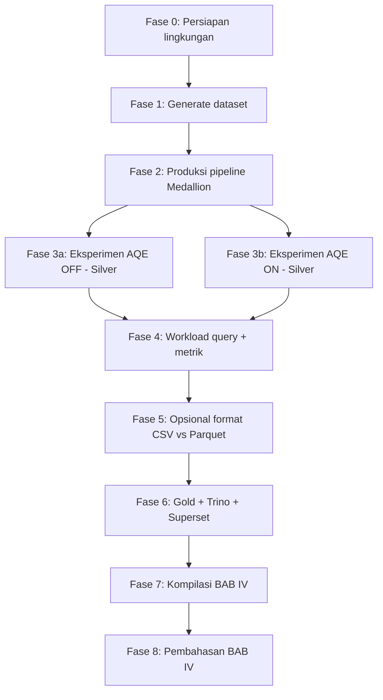

# Alur Eksperimen Produksi & Pengujian AQE

Panduan operasional menjalankan pipeline di lingkungan produksi (Docker), menguji skenario **AQE OFF vs ON**, dan mencatat bukti untuk **BAB III Metodologi** serta **BAB IV Hasil dan Pembahasan**.

Acuan outline: [`../../rancangan-metodologi-dan-hasil-pembahasan.md`](../../rancangan-metodologi-dan-hasil-pembahasan.md).

**Panduan teknis terkait:**

| Topik | Dokumen |
|-------|---------|
| Arsitektur & metrik | [`../README.md`](../README.md) |
| Generate data | [`../../README.md`](../../README.md) §9 |
| Pipeline 1–3 | [`../staging-to-bronze/`](../staging-to-bronze/README.md) · [`../bronze-to-silver/`](../bronze-to-silver/README.md) · [`../silver-to-gold/`](../silver-to-gold/README.md) |
| Serving (Trino/Superset) | [`../gold-to-serving/`](../gold-to-serving/README.md) |
| Monitoring | [`../monitoring-grafana/`](../monitoring-grafana/README.md) |
| Template pencatatan | [`templates/`](templates/) |
| **Benchmark otomatis (E2E)** | [`../../scripts/benchmark/README.md`](../../scripts/benchmark/README.md) |

---

## 0. Mode otomatis end-to-end (disarankan)

Satu perintah menjalankan upload staging, pipeline Medallion, workload Spark/Trino, perbandingan AQE, dan agregasi metrik:

```bash
python3 scripts/generate_bronze_data.py --mode full --profile aqe
./start.sh
docker exec lhaqe-airflow-scheduler airflow dags trigger aqe_full_experiment
```

**Output:** folder [`../../metrics/`](../../metrics/) + dashboard Grafana **Lakehouse AQE Experiment** (http://localhost:13001).

Alternatif tanpa Airflow (Spark dapat dijangkau dari host):

```bash
PYTHONPATH=scripts AQE_METRICS_DIR=metrics python3 scripts/benchmark/run_experiment.py
```

| File metrik | Isi |
|-------------|-----|
| `experiment_summary_latest.json` | Ringkasan seluruh run |
| `aqe_comparison_*.json` | Speedup Silver + workload |
| `workloads_spark_aqe_*.json` | W1–W3 |
| `workloads_trino_ctx_*.json` | W4–W6 |

---

## 1. Diagram alur eksperimen



**Prinsip eksperimen:** *controlled experiment* — hanya **konfigurasi AQE** yang berubah; dataset, cluster, DAG, dan query set harus identik.

| Variabel | Definisi | Dikontrol bagaimana |
|----------|----------|---------------------|
| **Independen** | AQE OFF / ON | `dag_run.conf`: `{"aqe_scenario":"OFF"}` vs `"ON"` |
| **Dependen** | Performa query & pipeline | Durasi, throughput, metrik partisi, efektivitas AQE |
| **Kontrol** | Dataset, cluster, query | Profil data sama; stack Docker sama; SQL workload sama |

---

## 2. Ringkasan fase → Metodologi → Hasil

| Fase | Apa yang Anda lakukan | Isi BAB III (Metodologi) | Isi BAB IV (Hasil) |
|------|------------------------|--------------------------|---------------------|
| **0** | `./start.sh`, catat spesifikasi HW | §3.2.1–3.2.3 | Konteks eksperimen (opsional di pembahasan) |
| **1** | `generate_bronze_data.py --profile aqe` | §3.3.1–3.3.3 | Deskripsi dataset |
| **2** | DAG Staging→Bronze→Gold | §3.4.1–3.4.4 | **§4.1.1** runtime pipeline |
| **3** | Silver DAG OFF lalu ON | §3.5.1, §3.4.3.2 | **§4.1.2**, **§4.1.6** |
| **4** | Spark UI + `metrics/*.json` + workload | §3.5.2, §3.6 | **§4.1.3**, **§4.1.4** |
| **5** | (Opsional) ulang dengan variasi format | §3.5.3 | **§4.1.5** |
| **6** | Trino query + Superset | §3.4.4.2, §10 docs | Dampak AQE di Gold (§4.1.6) |
| **7** | Isi template + grafik | — | **§4.1.1–4.1.6** |
| **8** | Narasi interpretasi | — | **§4.2** |

---

## 3. Fase 0 — Persiapan lingkungan

**Tujuan metodologi:** §3.2 Lingkungan eksperimen dan konfigurasi sistem.

### 3.1 Checklist

```bash
cd /path/to/Data-Lakehouse-AQE
cp .env.example .env          # opsional: port
./scripts/download-jars.sh    # atau lewat ./start.sh
./start.sh
docker compose ps             # semua lhaqe-* healthy
```

### 3.2 Yang harus dicatat (→ template `01-lingkungan-eksperimen.md`)

| Item | Contoh nilai | Subbab metodologi |
|------|--------------|-------------------|
| Tanggal eksperimen | 2026-05-17 | — |
| OS / CPU / RAM / disk | macOS, M2, 16 GB, 512 GB SSD | §3.2.1 |
| Spark workers | 2 × 2 core, 2500m | §3.2.1 |
| Spark version | 3.5.1 | §3.2.2 |
| `SPARK_SHUFFLE_PARTITIONS` | 200 | §3.2.3 |
| Parameter AQE OFF / ON | lihat [`../../README.md`](../../README.md) §6 | §3.2.3 |
| Profil data | `aqe`, skew 75% → SD (Sains Data) | §3.3 |

---

## 4. Fase 1 — Generate dataset

**Tujuan metodologi:** §3.3 Dataset dan karakteristik data.

```bash
# Produksi / eksperimen utama (~1M mahasiswa, skew)
python3 scripts/generate_bronze_data.py --mode full --profile aqe --dry-run   # cek dulu
python3 scripts/generate_bronze_data.py --mode full --profile aqe
```

### Yang dicatat

| Item | Cara dapat | Subbab |
|------|------------|--------|
| Jumlah baris per tabel | Output skrip / `wc -l data/staging/*.csv` | §3.3.2 |
| Ukuran file (MB) | `du -sh data/staging` | §3.3.2 |
| Skew `prodi_id` | `--skew-fraction`, `--skew-prodi` | §3.3.3 |
| Distribusi key (sample) | Query Spark/Trino setelah Bronze | §3.3.3 |

Template: [`templates/02-dataset.md`](templates/02-dataset.md)

---

## 5. Fase 2 — Produksi pipeline Medallion (baseline operasional)

**Tujuan:** membangun Bronze, Silver (satu skenario awal), Gold sebelum eksperimen komparatif.

**Urutan wajib:**

```bash
# 1. Staging → Bronze
docker exec lhaqe-airflow-scheduler airflow dags trigger staging_to_bronze_pipeline
# tunggu sukses di UI http://localhost:18681

# 2. Bronze → Silver (gunakan OFF dulu sebagai baseline ingest ke Silver)
docker exec lhaqe-airflow-scheduler airflow dags trigger bronze_to_silver_pipeline \
  --conf '{"aqe_scenario":"OFF"}'

# 3. Silver → Gold
docker exec lhaqe-airflow-scheduler airflow dags trigger silver_to_gold_pipeline
```

### Verifikasi

```bash
# Spark
docker exec lhaqe-spark-master /opt/spark/bin/spark-sql -e "SHOW TABLES IN lakehouse.gold"

# Trino
docker exec -it lhaqe-trino trino --execute "SHOW TABLES FROM lakehouse.gold"
```

### Yang dicatat → **§4.1.1 Hasil eksekusi pipeline**

| Pipeline | DAG | Task utama | Waktu mulai/selesai | Status | Durasi (s) |
|----------|-----|------------|---------------------|--------|------------|
| Staging→Bronze | `staging_to_bronze_pipeline` | upload + spark | | | |
| Bronze→Silver | `bronze_to_silver_pipeline` | bronze_to_silver | | | |
| Silver→Gold | `silver_to_gold_pipeline` | silver_to_gold | | | |
| **Total end-to-end** | | | | | |

Sumber waktu: Airflow UI → DAG run → **Duration**, atau log task.

Template: [`templates/03-runtime-pipeline.md`](templates/03-runtime-pipeline.md)

---

## 6. Fase 3 — Eksperimen komparatif AQE (inti penelitian)

**Tujuan metodologi:** §3.5.1 Variasi konfigurasi AQE; §3.4.3 Implementasi AQE di Silver.

> **Penting:** Untuk perbandingan adil, **ulang hanya tahap Silver** (atau full refresh Silver dari Bronze yang sama). Opsi A: dua run Silver berturut pada Bronze yang sama. Opsi B: dua lingkungan run terpisah dengan snapshot Bronze identik.

### 6.1 Run A — AQE OFF (baseline)

```bash
docker exec lhaqe-airflow-scheduler airflow dags trigger bronze_to_silver_pipeline \
  --conf '{"aqe_scenario":"OFF"}'
```

Setelah selesai:

```bash
ls -la metrics/bronze_to_silver_aqe_OFF_*.json
```

Buka Spark UI → aplikasi **`bronze_to_silver_AQE_OFF`** → screenshot stages/SQL.

### 6.2 Run B — AQE ON

```bash
docker exec lhaqe-airflow-scheduler airflow dags trigger bronze_to_silver_pipeline \
  --conf '{"aqe_scenario":"ON"}'
```

```bash
ls -la metrics/bronze_to_silver_aqe_ON_*.json
```

Spark UI → **`bronze_to_silver_AQE_ON`**.

### 6.3 Hitung speedup

$$
\text{Speedup ($\%$)} = \frac{T_{\text{OFF}} - T_{\text{ON}}}{T_{\text{OFF}}} \times 100
$$

Gunakan `duration_sec` dari file JSON atau durasi Airflow task `bronze_to_silver`.

Template: [`templates/04-perbandingan-aqe.md`](templates/04-perbandingan-aqe.md) → **§4.1.2**

---

## 7. Fase 4 — Workload query & metrik lanjutan

**Tujuan metodologi:** §3.5.2 Workload; §3.6 Metrik evaluasi.

### 7.0 Otomatis (skrip benchmark)

```bash
PYTHONPATH=scripts AQE_METRICS_DIR=metrics \
  python3 scripts/benchmark/run_spark_workloads.py --aqe-scenario OFF
PYTHONPATH=scripts AQE_METRICS_DIR=metrics \
  python3 scripts/benchmark/run_spark_workloads.py --aqe-scenario ON

# Setelah Gold terisi (OFF lalu ON — lihat alur DAG aqe_full_experiment):
python3 scripts/benchmark/run_trino_workloads.py --aqe-context OFF --trino-url http://localhost:18088
python3 scripts/benchmark/run_trino_workloads.py --aqe-context ON --trino-url http://localhost:18088

python3 scripts/benchmark/compare_aqe_runs.py --markdown
python3 scripts/benchmark/aggregate_results.py --write-latest
```

### 7.1 Workload di Spark (manual / notebook)

Jalankan di Jupyter http://localhost:18888 atau job Spark terpisah dengan `SPARK_AQE_SCENARIO` OFF/ON.

| ID | Tipe | Query referensi |
|----|------|-----------------|
| W1 | Join | `silver_mahasiswa` ⋈ `silver_dosen` on key prodi |
| W2 | Aggregation | `GROUP BY prodi_id`, `COUNT(*)` |
| W3 | Filtering | `WHERE angkatan >= 2020` + join dim |

Detail: [`../bronze-to-silver/README.md`](../bronze-to-silver/README.md)

### 7.2 Workload di Trino (Gold) — dampak downstream

```sql
-- W4 Join (Gold)
SELECT p.nama_prodi, COUNT(*) n
FROM lakehouse.gold.fact_iku1_lulusan f
JOIN lakehouse.gold.dim_prodi p ON f.prodi_id = p.prodi_id
GROUP BY p.nama_prodi;

-- W5 Aggregation
SELECT w.tahun, AVG(r.nilai_capaian)
FROM lakehouse.gold.fact_rekap_iku_institusi r
JOIN lakehouse.gold.dim_waktu w ON r.waktu_id = w.waktu_id
GROUP BY w.tahun;
```

Catat **waktu query** Trino untuk run setelah pipeline OFF vs ON di Silver → **§4.1.6**.

### 7.3 Metrik yang dicatat per fase 4

| Kategori | Metrik | Sumber | BAB IV |
|----------|--------|--------|--------|
| Runtime | execution time, throughput, speedup | JSON, Airflow | §4.1.2 |
| Partisi | mean, std, CV, Gini | Spark UI / analisis | §4.1.3 |
| AQE DPP | partisi sebelum/sesudah, reduction % | Spark plan | §4.1.4.1 |
| Coalescing | jumlah partisi, ratio | Spark UI | §4.1.4.2 |
| Skew join | distribusi task | Spark UI | §4.1.4.3 |
| Resource | CPU, memori | `docker stats`, Spark executors | §4.1.5 / pembahasan |

Panduan monitoring: [`../monitoring-grafana/README.md`](../monitoring-grafana/README.md)

Template: [`templates/05-metrik-partisi-aqe.md`](templates/05-metrik-partisi-aqe.md)

---

## 8. Fase 5 — Variasi format data (opsional)

**Tujuan metodologi:** §3.5.3 CSV vs Parquet.

| Run | Staging format | Pipeline |
|-----|----------------|----------|
| F1 | CSV (default) | Sudah di Fase 2–4 |
| F2 | Parquet di staging | Konversi staging atau generate ulang; ulang Staging→Bronze |

Catat execution time per tahap → **§4.1.5**.

---

## 9. Fase 6 — Serving layer & validasi bisnis

Setelah task **`silver_to_gold_on`** di DAG `aqe_full_experiment` sukses, layer Gold di MinIO (`warehouse` → namespace `gold`) biasanya memuat:

| Layer | Tabel (tipikal) |
|-------|-----------------|
| **Dimensi (5)** | `dim_waktu`, `dim_prodi`, `dim_dosen`, `dim_mahasiswa`, `dim_topik_penelitian` |
| **Fakta (5+)** | `fact_iku4_kualifikasi_dosen`, `fact_iku6_kerjasama_prodi`, `fact_iku7_metode_pembelajaran`, `fact_iku8_akreditasi_internasional`, `fact_tata_kelola` |
| **Opsional** | `fact_iku1`…`iku5`, `fact_rekap_iku_institusi` (jika builder tidak error) |

Verifikasi:

```bash
docker exec lhaqe-trino trino --execute "SHOW TABLES FROM lakehouse.gold"
```

### 9.1 Trino & Superset

Panduan lengkap: [`../gold-to-serving/README.md`](../gold-to-serving/README.md)

1. Koneksi Superset → `trino://admin@trino:8080/lakehouse`
2. Buat **dataset fisik** per tabel yang ada (§5.3.2)
3. Buat **dataset virtual** SQL untuk join fact–dim (§6)

### 9.2 KPI dashboard Superset (disarankan)

Selaras data aktual dari eksperimen — **bukan asumsi 8 IKU penuh** jika `fact_rekap` belum ada:

| Dashboard | KPI utama | Tabel / dataset |
|-----------|-----------|-----------------|
| **Executive IKU (subset)** | IKU-4 kualifikasi dosen; IKU-6 kerjasama prodi; IKU-7 metode pembelajaran; IKU-8 akreditasi internasional; tata kelola (realisasi anggaran, SAKIP) | Fakta IKU-4/6/7/8 + `fact_tata_kelola` + `v_rekap_iku_subset` |
| **Profil institusi** | Jumlah dosen/mahasiswa per prodi & angkatan; sebaran jurusan | `dim_*` |
| **Prodi Sains Data (SD)** | Capaian IKU-4/7 untuk `prodi_id=SD` (hot key skew eksperimen) | Filter `dim_prodi` + fakta join |
| **Evaluasi AQE** | Speedup pipeline, latency Trino | **Grafana** + `metrics/*.json` (bukan Superset) |

**Filter global:** `dim_waktu.tahun`, `dim_prodi.nama_prodi` / `nama_jurusan`.

### 9.3 Yang dicatat untuk laporan

| Item | Cara | Subbab |
|------|------|--------|
| Daftar tabel Gold aktual | Screenshot MinIO atau output `SHOW TABLES` | §4.1.1 / konteks |
| Screenshot dashboard Superset | Minimal 1 executive + 1 drill-down SD | Lampiran |
| Latency Trino W4–W6 | `metrics/workloads_trino_ctx_OFF_*.json` vs `ON` | **§4.1.6** |
| Validasi bisnis | Narasi: KPI mana yang terpenuhi / di bawah target | §4.2 |

---

## 10. Fase 7 — Kompilasi Hasil (BAB IV)

Isi semua template di [`templates/`](templates/), lalu salin ke laporan.

| Subbab hasil | File template | Artefak wajib |
|--------------|---------------|---------------|
| **4.1.1** | `03-runtime-pipeline.md` | Tabel runtime + screenshot Airflow |
| **4.1.2** | `04-perbandingan-aqe.md` | Tabel + **grafik bar/line speedup** |
| **4.1.3** | `05-metrik-partisi-aqe.md` | Tabel distribusi + histogram |
| **4.1.4.1–3** | `05-metrik-partisi-aqe.md` | Screenshot Spark SQL plan |
| **4.1.5** | `06-format-data.md` | Tabel CSV vs Parquet |
| **4.1.6** | `07-dampak-per-layer.md` | Tabel Bronze/Silver/Gold |

Folder artefak disarankan:

```text
experiment-runs/
├── run-2026-05-17/
│   ├── screenshots/          # Spark UI, Grafana, Superset
│   ├── metrics/              # salinan JSON dari metrics/
│   ├── logs/                 # cuplikan Airflow
│   └── templates-filled/     # template terisi
```

---

## 11. Fase 8 — Pembahasan (BAB IV §4.2)

Setelah angka terisi, jawab secara naratif:

| Pertanyaan pembahasan | Petunjuk |
|-----------------------|----------|
| Mengapa Silver paling terpengaruh AQE? | Join/agregasi, shuffle volume |
| Mengapa ON lebih cepat/lambat? | Speedup, overhead adaptasi pada data kecil |
| Peran runtime statistics? | §5 docs README — Adaptive Optimizer |
| DPP / coalescing / skew mana yang dominan? | §4.1.4 |
| Keterbatasan Docker lokal? | RAM, 2 worker, bukan cluster YARN |
| Implikasi produksi? | Rekomendasi `AQE ON` + tuning `shuffle.partitions` |

---

## 12. Cheat sheet perintah

```bash
# Status
docker compose ps

# Trigger pipeline
docker exec lhaqe-airflow-scheduler airflow dags trigger staging_to_bronze_pipeline
docker exec lhaqe-airflow-scheduler airflow dags trigger bronze_to_silver_pipeline --conf '{"aqe_scenario":"OFF"}'
docker exec lhaqe-airflow-scheduler airflow dags trigger bronze_to_silver_pipeline --conf '{"aqe_scenario":"ON"}'
docker exec lhaqe-airflow-scheduler airflow dags trigger silver_to_gold_pipeline

# Metrik AQE
ls metrics/bronze_to_silver_aqe_*.json
python3 -c "import json,glob;[print(json.load(open(f))['aqe_scenario'],json.load(open(f))['duration_sec']) for f in glob.glob('metrics/bronze_to_silver_aqe_*.json')]"

# UI
open http://localhost:18681   # Airflow
open http://localhost:18080   # Spark
open http://localhost:13001   # Grafana
open http://localhost:18088   # Trino
open http://localhost:18089   # Superset
```

---

## 13. Urutan hari yang disarankan (contoh jadwal)

| Hari | Aktivitas |
|------|-----------|
| **H1** | Fase 0–1: stack + generate data + catat lingkungan & dataset |
| **H2** | Fase 2: produksi full pipeline + verifikasi Trino |
| **H3** | Fase 3–4: AQE OFF/ON + screenshot Spark + isi template 04–05 |
| **H4** | Fase 6–7: Superset (IKU-4/6/7/8 + SD) + kompilasi grafik BAB IV |
| **H5** | Fase 8: pembahasan |

---

**Mulai dari:** [Fase 0](#3-fase-0--persiapan-lingkungan) · **Template kosong:** [`templates/`](templates/)
